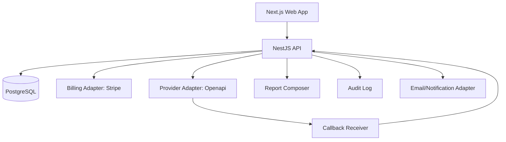

# Architettura tecnica

## Principio architetturale

La piattaforma deve essere **orchestration-first**: il backend non espone direttamente Openapi al frontend, ma orchestra richieste, pagamenti, normalizzazione, audit, report e stati.



## Moduli backend

| Modulo | Responsabilità |
|---|---|
| Auth | login, ruoli, sessioni, API key future |
| Organizations | aziende clienti, billing profile, team |
| Products | catalogo servizi, prezzi, bundle, margine |
| Orders | ordine commerciale, stato pagamento, fattura |
| Checks | richiesta verifica, stato provider, risultato normalizzato |
| Provider | adapter Openapi, token, rate limit, retry, callback |
| Billing | Stripe Checkout, webhooks, subscription |
| Reports | composizione report HTML/PDF, snapshot dati |
| Audit | tracciamento eventi sensibili e decisioni |
| Admin | gestione catalogo, prezzi, incidenti, retry manuali |

## Stati principali

### OrderStatus

- `draft`
- `pending_payment`
- `paid`
- `processing`
- `completed`
- `failed`
- `refunded`
- `cancelled`

### CheckStatus

- `queued`
- `provider_requested`
- `waiting_callback`
- `processing_result`
- `completed`
- `requires_review`
- `failed`

## Multi-tenancy iniziale

Per l’MVP è sufficiente un modello B2B con `organization_id` su tutte le entità operative. Ogni query deve essere filtrata per organizzazione. In futuro si potranno aggiungere team, ruoli granulari e API key per organization.

## Provider abstraction

Non usare chiamate Openapi sparse nel codice. Tutto deve passare da:

```ts
ProviderAdapter.requestCheck(productCode, subject, context)
ProviderAdapter.getResult(providerRequestId)
ProviderAdapter.handleCallback(payload, signature)
```

Questo consente di:

- cambiare provider;
- aggiungere Creditsafe/Cerved in futuro;
- simulare provider in test;
- tracciare costi e margini per singola richiesta.

## Report snapshot

Il report mostrato al cliente deve essere uno snapshot persistito, non una vista live del provider. Ogni report deve salvare:

- input richiesto;
- prodotto acquistato;
- provider usato;
- timestamp richiesta;
- timestamp completamento;
- risultato normalizzato;
- eventuali red flags;
- fonte e disclaimer;
- audit trail.

## Feature flag obbligatori

- `ENABLE_PROVIDER_CALLS`: blocca o abilita chiamate reali provider;
- `ENABLE_CHECKOUT`: blocca o abilita pagamenti reali;
- `ENABLE_DEMO_DATA`: abilita demo solo in ambienti non produttivi;
- `ENABLE_API_PARTNER`: abilita API esterne future;
- `ENABLE_MONITORING`: abilita monitoraggio soggetti.
