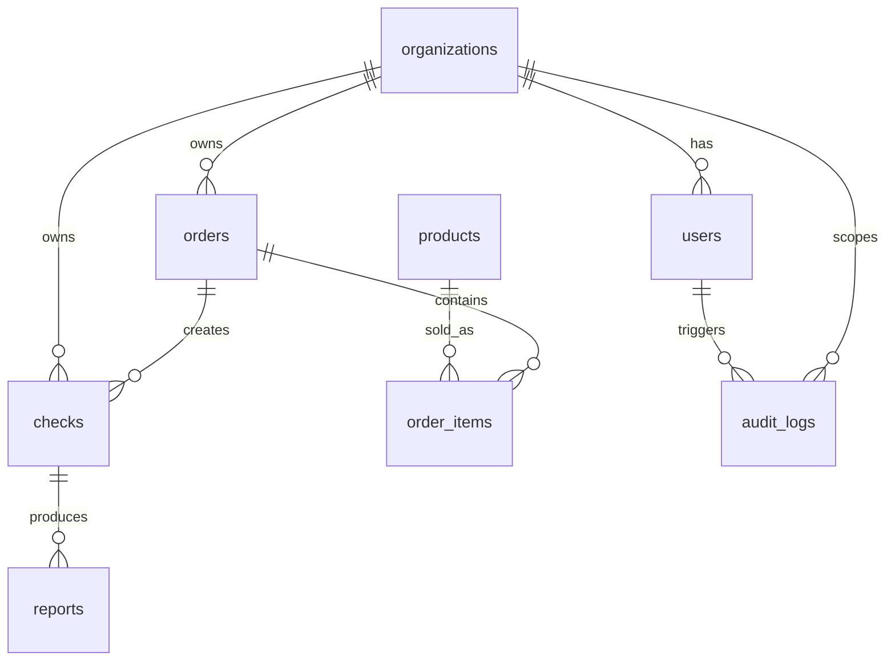

# Data model iniziale

## Tabelle principali

## Organization

- id
- name
- vatNumber
- billingEmail
- planCode
- createdAt
- updatedAt

## User

- id
- organizationId
- email
- fullName
- role
- passwordHash
- createdAt
- updatedAt

## Product

- id
- code
- name
- category
- description
- publicPriceCents
- estimatedProviderCostCents
- taxRate
- active
- requiresLegalBasis
- providerConfig JSONB

## Order

- id
- organizationId
- userId
- status
- totalCents
- taxCents
- currency
- checkoutProvider
- checkoutSessionId
- paidAt
- createdAt
- updatedAt

## Check

- id
- organizationId
- orderId
- productId
- requestedByUserId
- subjectType
- subjectPayload JSONB
- status
- providerName
- providerRequestId
- normalizedResult JSONB
- riskLevel
- completedAt
- createdAt
- updatedAt

## Report

- id
- checkId
- title
- htmlSnapshot
- pdfPath future
- dataSnapshot JSONB
- createdAt

## AuditLog

- id
- organizationId
- actorUserId nullable
- eventType
- entityType
- entityId
- metadata JSONB
- ipAddress
- userAgent
- createdAt
