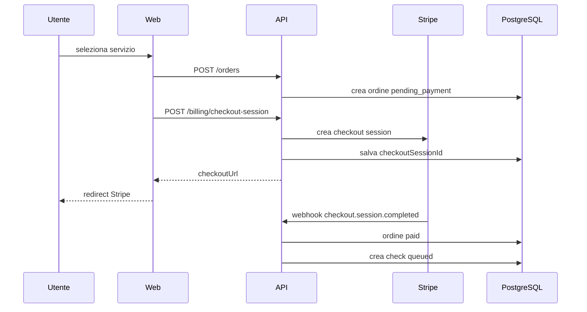

# Checkout e billing

## Provider MVP

Provider principale: Stripe Checkout.

Motivo:

- riduce complessità PCI;
- supporta pagamenti una tantum e subscription;
- gestisce redirect, sessioni, webhook;
- consente sconti/coupon in fase successiva.

## Flusso



## Idempotenza

- Ogni ordine ha `checkoutSessionId` unico.
- Ogni webhook deve essere gestito una sola volta.
- Se Stripe invia webhook duplicato, non creare doppio check.

## Sicurezza

- Verificare sempre firma webhook.
- Non fidarsi di `success_url` frontend come prova pagamento.
- Abilitare verifica provider solo dopo webhook valido.

## Nexi/Mollie

Non implementare nel primo sprint di sviluppo. Creare solo interfaccia adapter:

```ts
interface BillingProviderAdapter {
  createCheckoutSession(order: Order): Promise<{ checkoutUrl: string; externalId: string }>;
  verifyWebhook(rawBody: Buffer, signature: string): Promise<BillingEvent>;
}
```
