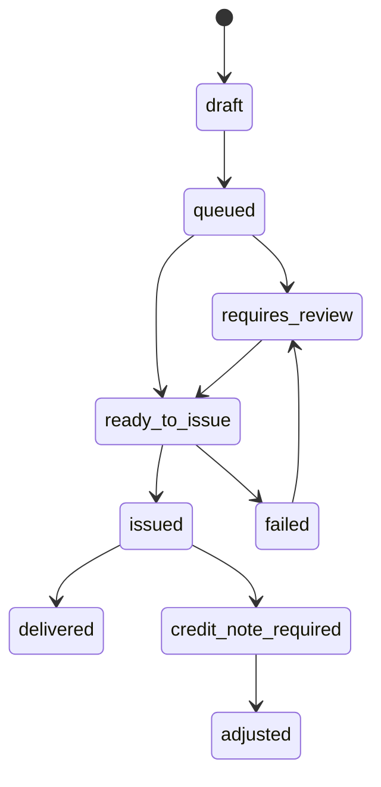

# Fiscal Document Lifecycle Blueprint

## Tipi documento

| Tipo | Uso MVP |
|---|---|
| `invoice` | Fattura per B2B o casi in cui e richiesta |
| `receipt` | Ricevuta/promemoria interno se applicabile e validato |
| `credit_note` | Rettifica collegata a fattura gia emessa |
| `proforma` | Documento non fiscale per riepilogo ordine, se utile |
| `manual_adjustment` | Rettifica amministrativa interna |

## Stati

## Regole

- `draft`: creato da ordine pagato o evento billing.
- `queued`: visibile al cliente come “in preparazione”.
- `requires_review`: richiede operatore fiscale/admin.
- `ready_to_issue`: dati pronti, ma nel MVP l'emissione resta manual-assisted.
- `issued`: documento registrato con numero/data e allegato/export.
- `delivered`: disponibile al cliente.
- `credit_note_required`: rimborso o rettifica dopo emissione.
- `failed`: dati errati o integrazione futura fallita.

## Numerazione

Nel MVP non generare numerazione fiscale definitiva senza validazione del processo. Usare `internalDocumentNumber` per tracking e `externalFiscalNumber` solo quando il documento e stato emesso realmente.

## Collegamenti obbligatori

Ogni documento deve collegarsi a:

- `orderId`;
- `paymentId` o `subscriptionInvoiceCycleId`;
- `billingProfileSnapshot`;
- `legalAcceptanceSnapshot`;
- eventuale `refundRequestId`;
- eventuale `creditNoteForDocumentId`.

## Cliente

Il cliente vede:

- tipo documento;
- importo;
- stato leggibile;
- data disponibilita se nota;
- eventuale azione richiesta.

Non vede:

- payload provider fiscale;
- errori tecnici;
- codici interni non necessari.
