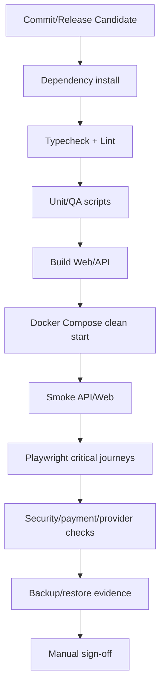

# 11 — Production QA Gate Blueprint

## Obiettivo
Definire il gate bloccante prima di ogni release candidata.

## Pipeline logica



## Gate 1 — Repository
Comandi previsti:

```bash
pnpm install --frozen-lockfile
pnpm -r typecheck
pnpm -r lint
pnpm -r test
pnpm run release:check
```

Bloccanti:
- errori TypeScript;
- lint error;
- QA script non passati;
- file `.env` reali o segreti nel repository;
- versioni pacchetto non allineate.

## Gate 2 — Runtime locale/container
Comandi previsti:

```bash
docker compose build --no-cache
docker compose up -d
node scripts/smoke-local-stack.js
```

Bloccanti:
- database non raggiungibile;
- API health non pronta;
- Web non pronto;
- errori startup;
- servizi mock abilitati con flag production.

## Gate 3 — Browser E2E
Suite obbligatorie:
- public funnel;
- checkout happy path mock/sandbox;
- customer login/dashboard/report access;
- admin operations review/action reason;
- partner sandbox API key;
- security access denial cross-account.

## Gate 4 — Produzione controllata
Prima del dominio pubblico:
- backup staging eseguito;
- restore staging provato;
- rollback image/tag documentato;
- legal/fiscal review completata;
- Stripe/PayPal webhook testato in sandbox;
- provider Openapi sandbox/mock controllato;
- support/admin escalation definita.
